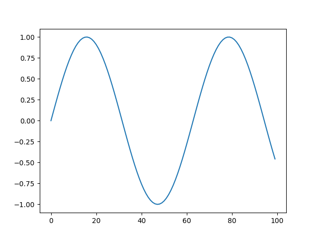

# Matplotlib for Chez Scheme


### powerful plotting library built on the popular Matplotlib



```
(define x (np-arange (int 0) (int 10) (float 0.1)))
(define y (np-sin x))
(plt-plot y)
(plt-show)
```


```
(define x (np-linspace (int 0) (int 10) (int 100)))
(define y (np-exp (np-negative x)))
(plt-plot y)
(plt-show)
```

## Depencies:

https://github.com/guenchi/Darkart

https://github.com/python/cpython

https://github.com/matplotlib/matplotlib

## Darkart's ecosystem

- [NumPy](https://github.com/guenchi/NumPy)

- [SciPy](https://github.com/guenchi/SciPy)

- [SymPy](https://github.com/guenchi/SymPy)

- [Matplotlib](https://github.com/guenchi/Matplotlib)

- [Pandas](https://github.com/guenchi/Pandas)
